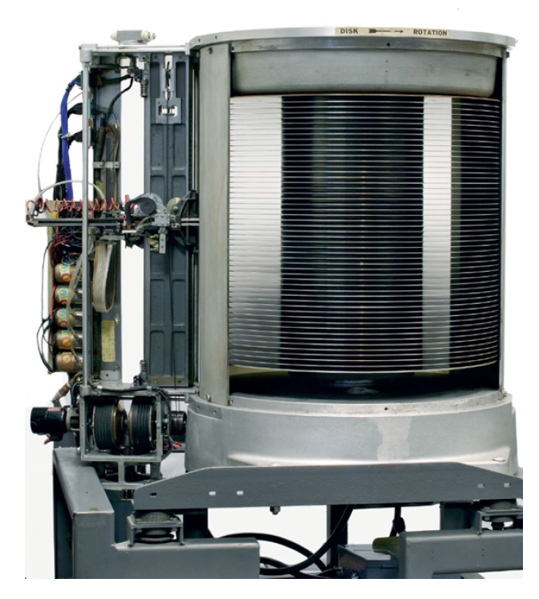
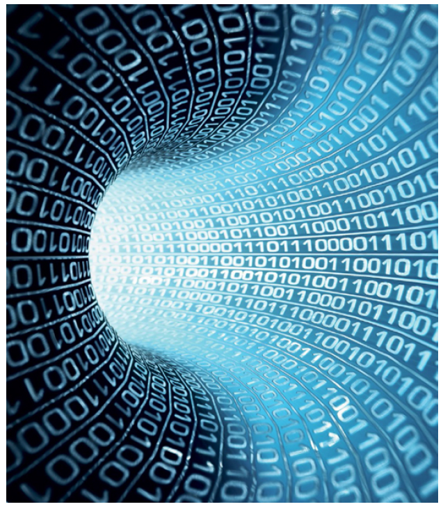
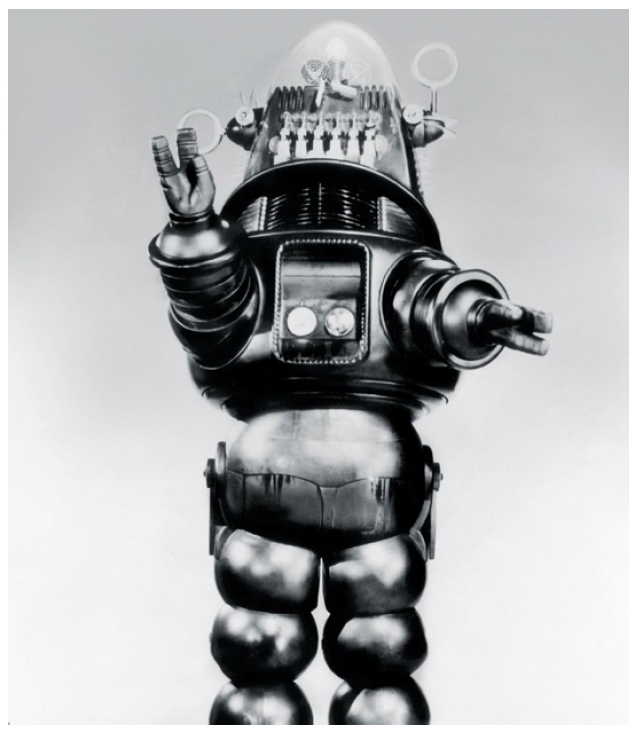
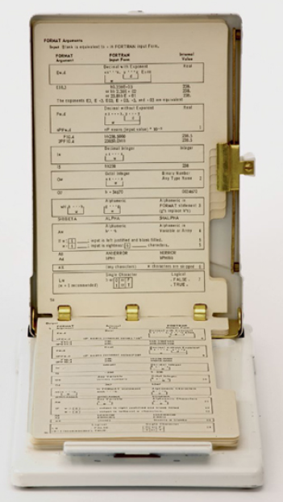
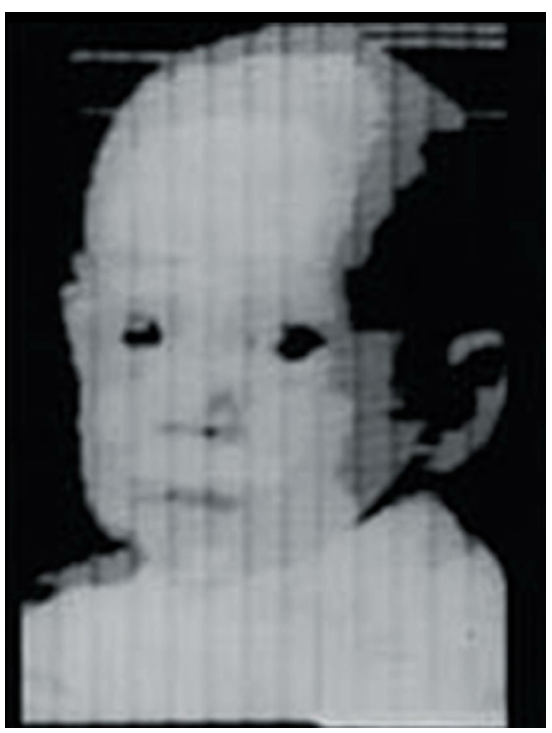
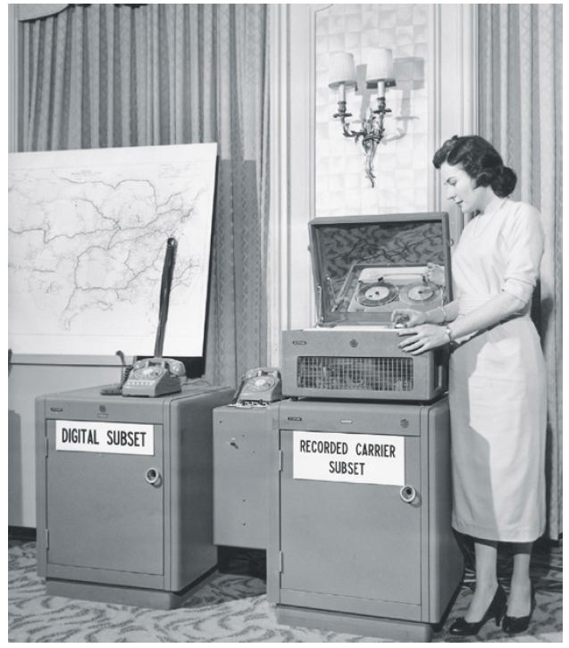
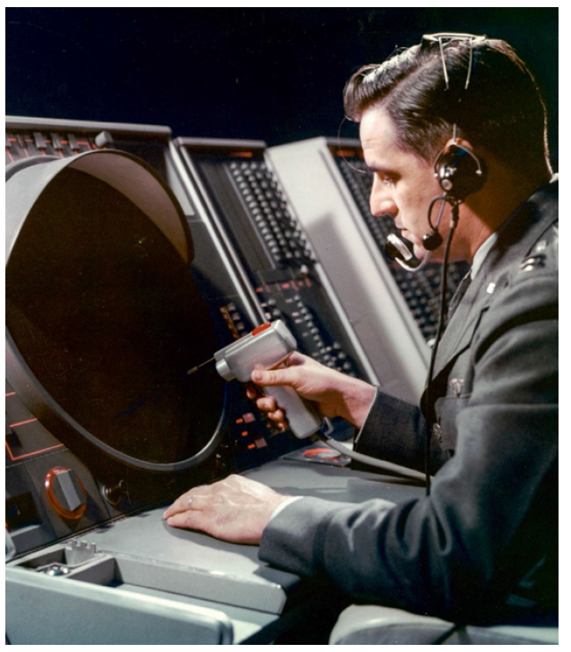
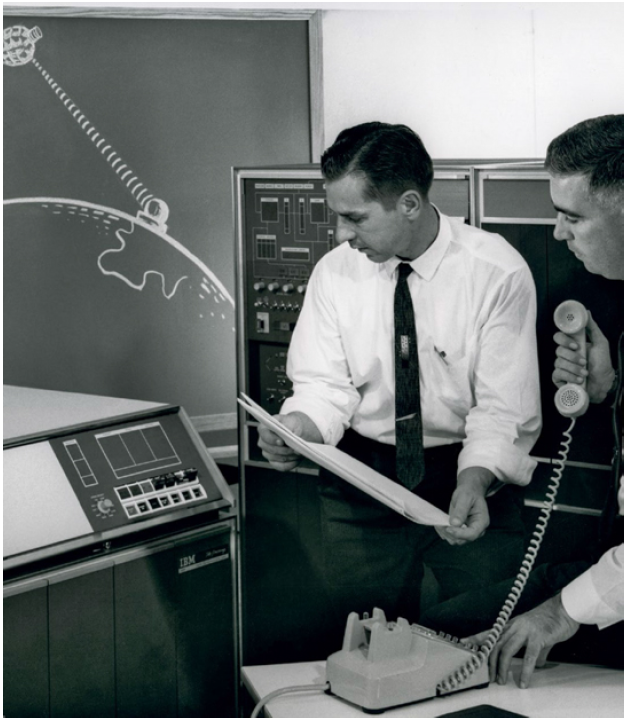
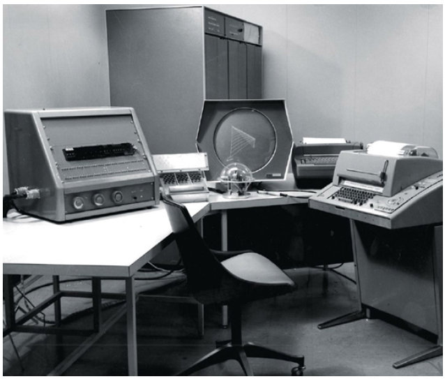

    <h2><b> Kelompok 4 </b></h2>
<h2><b> Mata Kuliah : Komputer Masyarakat </b></h2>
<h2><b>Materi : 1956 - 1964 Teletype Model 33 ASR </b></h2>

### Fahrurrazi (1910131210002)

### Resti Nur Amallia (1910131120002)

---

# 1956

## First Disk Storage Unit (Unit Penyimpanan Disk yang Pertama)

### **Reynold B. Johnson (1906 - 1998)**

---

drive disk magnetik memiliki bagian penting dari komputasi sejak ditemukan oleh IBM dan di demonstrasi di depan umum pad 14 September 1956.
    
IBM 305 RAMAC (Random Access Method Of Accounting and Control) dirancang untuk menyimpan file akuntansi dan inventaris yang sebelumnya telah disimpan sebagai kotak kartu punch IBM atau pada pita.

RAMAC dikirimkan dengan unit penyimpanan disk IBM 350, perangkat baru yang menyimpan data pada 50 disk yang berputar, masing-masing berukuran 24 inci (61 sentimeter) dan berputar pada 1.200 putaran per menit (RPM). diatur dalam blok 100 karakter yang dapat diakses, dibaca, dan ditulis ulang secara acak.

RAMAC memungkinkan komputer dengan hanya beberapa kilobyte
memori utama untuk mengakses 5 juta karakter dengan cepat setara dengan 64.000 kartu punch.

Tidak seperti drive modern, yang memiliki kepala untuk setiap disk, RAMAC memiliki satu kepala yang bergerak ke atas dan ke bawah untuk memilih disk, dan kemudian untuk memilih blok tertentu di mana data akan dibaca atau ditulis. Waktu akses rata-rata adalah enam persepuluh detik.

RAMAC juga dilengkapi dengan memori drum berputar yang berputar pada 6.000 RPM dan menyimpan 3.200 karakter pada 32 trek 100 karakter masing-masing.

<i> Aktuator RAMAC dan tumpukan disk, dengan lima puluh disk 24 inci (61 sentimeter) yang berputar pada 1.200 RPM, menyimpan 5 juta karakter informasi. </i>

----

## 1956

## Byte

### **Werner Buchholz (b. 1922), Louis G. Dooley (dates unavailable)**

---

Kata byte diciptakan secara bersamaan pada tahun 1956 oleh Werner Buchholz di IBM, bekerja di IBM STRETCH (super computer pertama didunia), dan Louis G, Dooley dan lainnya di Lab MIT Lincoln bekerja pada sistem pertahanan udara. dalam kedua kasus, mereka menggunakan kata byt untuk menggambarkan input dan output dari instruksi mesin yang dapat beroperasi pada kurang dari satu kata penuh. STRETCH memiliki kata 60-bit dab digunakan byte 8-bit untuk mewakili karakter untuk sistem input/outputnya.

selama 20 tahun, definisi byte agak berubah-ubah, IBM menggunakan byte 8-bit dengan arsitektur system/360-nya, dan grup 8-bit adalah standar untuk saluran telepon digital jarak jauh.

Namun demikian, pada 1980-an, penerimaan byte 8-bit hampir
universal sebagian besar merupakan hasil dari revolusi komputer mikro, karena mikro
menggunakan byte 8-bit hampir secara eksklusif. Sebagian itu karena 8 bit adalah genap
kekuatan 2, yang membuatnya lebih mudah untuk merancang perangkat keras komputer
dengan 8-bit byte dibandingkan dengan 9-bit byte.

<i> Komputer saat ini paling sering menggunakan byte yang terdiri dari 8 bit, diwakili oleh 1s dan 0s. </i>

---

## 1956

## Robby sang Robot

---

**Robby sang Robot** melakukan debut dunianya sebagai karakter fiksi dalam film Planet Terlarang, ditahun yang sama saat penggorengan anti lengket diluncurkan pasar dan kapal udara ditemukan. pada 1950 an, dampak dan potensi penerapan teknologi baik dan buruk muncul dalam berbagai bentuk dalam budaya populer, serta menyebar ke rumah berbagai komoditas dalam berbagai bentuk. dikenal karena kepribadiannya yang cerdas dan kehadiran visual nya yang unik, Robby adalah simbol dari tema yang lebih dalam dan kecemasan masyarakat terhadap kemajuan teknologi. dapat dipercaya sebagai karakter nyata dan sebagai robot, Robby menjadi simbol abadi dari janji robot yang ramah dan membantuk meskipun Robby sebenarnya adalah orang yang berjalan didalam tabung plastik, bentuk vakum 6 kaki 11 inci.

Robby benar-benar mesin yang canggih, dengan kemampuan untuk berkomunikasi fasih dalam 187 bahasa dan memasak makanan Dr. Morbius dengan mereproduksi molekul dalam berbagai bentuk dan jumlah. Robby seperti R.U.R. pada tahun 1920 dan Maria dari Metropolis pada tahun 1927, membantu membayangkan para ilmuwan komputer dan masyarakat umum seperti apa potensi teknis dan praktis komputer dan peran yang bisa dimainkan mesin tersebut dalam masyarakat manusia. Robby adalah sebagai banyak inspirasi bagi ilmuwan komputer dan penemu pemula seperti dia penghibur bagi masyarakat umum.

<i> Robby si Robot, dari film Planet Terlarang, 1956. </i>

---

# 1957

## FORTRAN

### **John Warner Backus (1924–2007)**

---

Ilmuwan komputer Amerika **John Warner Backus** punya ide yang lebih baik. Alih-alih programmer dengan susah payah menerjemahkan fungsi matematika, mereka ingin memecahkan kode mesin, mengapa komputer tidak melakukannya? Dia mengusulkan visinya tentang program komputer yang secara otomatis diterjemahkan formula menjadi kode mesin untuk manajemennya di IBM pada tahun 1953, dirakit sebuah tim pada tahun 1954 untuk membuat Penerjemahan Rumus Matematika IBM System, dan mengirimkan kompiler FORTRAN pertama ke pelanggan IBM di April 1957.

FORTRAN, yang merupakan singkatan dari **FORmula TRANslation,** secara dramatis menyederhanakan praktik penulisan program. Lebih mudah untuk menulis, membaca, dan menghasilkan kode yang lebih andal. Misalnya untuk menghitung panjang dari hipoten segitiga, seorang programmer cukup menulis 
|        KODE             |
|       :----:            |
|`C = SQRT(A * A + B * B)`|
 
mungkin diurutkan ada 20 instruksi kode mesin. Untuk karyanya di FORTRAN dan pekerjaan selanjutnya yang melibatkan compiler teori. FORTRAN sebenarnya adalah bahasa komputer kedua yang digunakan **Backus**. Yang pertama, Speedcoding adalah kode yang ditafsirkan lebih mudah untuk menulis tetapi berlari 10 hingga 20 kali lebih lambat dari kode mesin. IBM pelanggan tidak mau membayar harga kinerja seperti itu hanya untuk produktivitas pemrogram. FORTRAN memperoleh penerimaan sebagian, karena itu kode mesin yang sering diproduksi yang berjalan lebih cepat daripada kode yang dihasilkan oleh pengkode manusia biasa.

<i> Referensi cepat programmer untuk bahasa pemrograman FORTRAN, menunjukkan perbedaan argumen untuk pernyataan FORMAT. </i>

---

# 1957

## First Digital Image (Gambar Digital Pertama)

### **Russell Kirsch (b. 1929)**

---

Bekerja di **Institut Standar dan Teknologi Nasional AS (NIST)**, **Russell Kirsch** mendukung tim matematikawan yang menggunakan **Standar
Eastern Automatic Computer (SEAC)** untuk memodelkan senjata termonuklir,
memprediksi cuaca, dan melakukan fungsi komputer dalam pemerintahan pada tahun 1950-an. Pada tahun 1957, NIST mulai menjawab pertanyaan: Apa yang akan terjadi jika komputer bisa melihat gambar? Dan dengan itu, **Kirsch** membuat pemindai yang membuat foto digital pertama.

Pemindai terdiri dari drum yang berputar dan sensor optik yang dapat dipindahkan secara independen di sepanjang sumbu drum. Rakitan sensor
dimulai di salah satu ujung drum dan bergerak sedikit setelah masing-masing revolusi penuh. Sensor hanya bisa mendeteksi ada tidaknya cahaya. membuat gambar skala abu-abu, **Kirsch** membuat beberapa pemindaian, masing-masing dengan filter berturut-turut lebih gelap di depan sensor, dan kemudian secara elektronik digabungkan hasilnya.

Untuk gambar pertama, **Kirsch** menempelkan foto persegi berukuran 2 inci (5 sentimeter) foto putranya yang berusia tiga bulan ke drum dan menyalakan mesin. gambar yang dihasilkan adalah matriks dari 176 baris digital, masing-masing dengan 176 sel skala abu-abu. **Kirsch** telah menemukan grafik raster, gagasan untuk menampilkan sebuah gambar atau grafik dengan matriks elemen gambar (sekarang disebut piksel).

Pemindai SEAC membuka seluruh area baru untuk penelitian komputer dan aplikasi. Pendekatan **Kirsch** dalam menyimpan gambar sebagai kisi-kisi angka
mendominasi semua aplikasi komputer yang melibatkan gambar, termasuk satelit citra, citra medis, dan bahkan warna dua dimensi yang sederhana ditampilkan di layar ponsel modern. Pendekatan alternatif untuk grafik komputer berdasarkan vektor cahaya yang digambar pada layar (disebut grafik vektor) bersaing dengan grafik raster pada 1960-an dan 1970-an, tetapi akhirnya rugi karena biayanya.

<i>Putra Russell Kirsch yang berusia tiga bulan, foto digital pertama, menunjukkan jutaan
foto bayi digital yang akan dibagikan di masa depan.</i>

---

# 1958

## The Bell 101 Modem (Modem Lonceng 101)

---

Modem (kependekan dari modulator/demodulator) mengubah informasi digital menjadi sinyal analog (proses yang dikenal sebagai modulasi) sehingga sinyal dapat ditransmisikan, dan kemudian di sisi penerima, mengubah sinyal analog kembali ke bit digital (demodulasi). Dari tahun 1958 hingga akhir 1990-an, modem akustik yang dihubungkan dengan jaringan telepon analog adalah cara utama komputer berkomunikasi dengan pengguna jarak jauh.

pada tahun 1958, AT&T merilis modem Bell 101 untuk digunakan dengan SAGE (Semi Automatic Ground Environment), sebuah sistem pertahanan udara AS. modem memungkinkan komunikasi melalui saluran telepon biasa pada 110 bit per detik (bit/s). Tahun berikutnya, AT&T membuat perangkat yang tersedia untuk pelanggan komersial. Bell 101 digantikan pada tahun 1962 dengan Bell 103 modem yang dapat mengirim dan menerima data pada kecepatan 300 bit/s.

Modem Bell terhubung langsung ke saluran telepon biasa, tetapi AT&T, yang pada saat itu menyediakan telepon jarak jauh dan lokal layanan, melarang pelanggannya memasang peralatan yang diproduksi oleh perusahaan lain. Kemudian, pada tahun 1968, Komunikasi Federal AS Komisi (FCC) memutuskan bahwa AT&T tidak dapat melarang perangkat menghubungkan ke saluran telepon jika mereka menggunakan coupler akustik. Dalam beberapa tahun, perusahaan seperti Novation® dan Hayes Microcomputer Products® menawarkan modem 300-baud yang kompatibel dengan Bell. Modem 300-baud dapat mengirimkan teks dengan kecepatan 30 karakter per detik atau 250 kata per menit. Pada tahun 1979, AT&T memperkenalkan modem Bell 212, yang
dapat mengirim dan menerima informasi empat kali lebih cepat.

<i> Bell 101 Dataset (1958) adalah modem komersial pertama yang mampu mengirimkan data digital. </i>

---

# 1958

## SAGE Computer Operation

### **Jay Forrester (1918–2016)**

---

Semi Automatic Ground Environment (SAGE) adalah jaringan dari komputer yang melindungi Amerika Serikat dari serangan mendadak Soviet sejak beroperasi pada tahun 1958 hingga dinonaktifkan pada tahun 1984.

Tugas SAGE sangat besar: sistem jaringan dari 24 komputer yang menyaksikan wilayah udara di dalam dan di sekitar Amerika Serikat, melacak setiap pesawat yang bergerak dan menandai mereka yang belum mengajukan rencana penerbangan. Ketika objek yang tidak dikenal muncul, SAGE akan menentukan yang mana rudal pencegat untuk meluncurkan dan menghitung lokasi intersepsi. Selain melindungi negara dari pembom Soviet, SAGE membantu dalam banyak penyelamatan pesawat kecil yang jatuh di laut.

**Profesor MIT Jay Forrester** memilih IBM sebagai mitra institut untuk
SAGE. sistem bertanggung jawab atas 80 persen pendapatan IBM selama
konstruksinya dan membuat IBM menjadi perusahaan raksasa. Jaringan itu sendiri
terdiri dari banyak pasang komputer (utama dan cadangan), dengan masing-masing
pasangan dibangun di rumah balok beton seluas satu hektar dan empat lantai
tinggi. Komputer IBM AN/FSQ-7 asli adalah komputer terbesar dibangun pada saat itu, masing-masing memiliki 60.000 tabung vakum dan 256 kibibytes RAM inti magnetik, dan berat 250 ton. Sepasang komputer mengendalikan 150 konsol video yang dilengkapi dengan senjata ringan yang digunakan operator untuk memilih target mereka.

<i> Kapten Charbonneau duduk di konsol tampilan situasi SAGE di Pusat Arah Eksperimental di Lincoln Labs. </i>

---

# 1959

## IBM 1401

---

IBM 1401 adalah komputer generasi kedua IBM. Dibangun dari transistor dan dirancang terutama untuk menyimpan catatan bisnis, tahun 1401 biaya rendah dan fleksibilitas menjadikannya komputer paling sukses di planet ini. Komputer dapat menyimpan data pada pita magnetik dan disk.

1401 diprogram dalam Autocode, atau di IBM Symbolic Sistem Pemrograman, yang hari ini kita sebut *assembler*. Menghindari kesalahan pembulatan biner, sistem bekerja dengan angka desimal. 8-bit memori yang digunakan 6 bit untuk pengkodean angka atau huruf, bit cek paritas (untuk mendeteksi kesalahan perangkat keras), dan bit ke-8 yang menandai akhir dari suatu angka atau teks. *“Tidak ada ruang yang terbuang dengan mengisi kata-kata yang panjangnya tetap,”* ditulis pada saat setiap bit.

Prosesor 1401 terdiri dari papan sirkuit cetak individu, juga disebut kartu, yang masing-masing berisi beberapa transistor dan komponen diskrit lainnya. Sistem dapat dibeli dengan 1.400, 2.000, 4.000, 8.000, 12.000, atau 16.000 karakter penyimpanan inti 8-bit. Konfigurasi kecil sangat menarik: usaha kecil dapat dengan mudah terkomputerisasi dengan menyewa 1401 hanya dengan $2.500 per bulan. (Sebagai perbandingan, IBM 701 komputer bisnis telah disewa seharga $15.000 per bulan pada tahun 1953). Besar organisasi yang sudah memiliki mainframe dapat menyewa 1401 untuk ditransfer data dari kartu punch berkecepatan lebih lambat ke pita, masukkan pita ke dalam mainframe, melakukan perhitungan mereka, mentransfer hasilnya kembali ke tape, dan gunakan 1401 untuk mencetak hasilnya. 1401 sukses besar pada akhir tahun 1961, ada lebih banyak lagi dari 2.000 sistem yang dipasang di Amerika Serikat, mewakili seperempat dari semua komputer yang terpasang. Pada saat IBM siap untuk menggantikan 1401 dengan garis System/360 yang sangat berbeda.

<i> Insinyur IBM Chester Siminitz dan C. Fred Woidt meninjau data pada komputer IBM 1401 yang dilengkapi dengan unit transmisi data IBM 1009, yang mengubah sinyal desimal berkode biner dari komputer menjadi kode transmisi khusus. </i>

---

# 1959

## PDP-1

### **Ben Gurley (1926–1963)**

---

 PDP-1 adalah mesin yang sama sekali berbeda dari yang berorientasi batch sistem yang dijual oleh IBM dan Sperry Rand. Mesin-mesin itu berharga 10.000 dolar AS
bulan untuk disewa; biaya PDP-1 antara $85.000 dan $120.000 untuk dibeli.
Dan PDP-1 interaktif, dengan opsi termasuk grafik besar layar, layar kecil beresolusi tinggi, pena ringan, jam waktu nyata, sebuah konverter analog-ke-digital multipleks (untuk antarmuka dengan laboratorium peralatan), dan keluaran audio. Itu lebih lambat dan lebih kecil dari komputer, tapi itu sangat berguna, bahkan ramah. Orang menyebutnya sebagai **komputer mini**. 

 Digital memberikan salah satu PDP-1 pertamanya kepada MIT, khususnya digunakan oleh siswa. 
 > *“Mereka belajar lebih banyak tentang komputer dan bagaimana melakukan sesuatu dengan itu daripada yang mungkin dimiliki siapa pun sebelumnya, karena  memiliki lusinan yang cerah orang menghabiskan berjam-jam sepanjang hari untuk mempelajari ini,”* **Ken Olsen (1926 – 2011)**.

salah satu pendiri Digital, mengatakan dalam wawancara sejarah lisan 1988 dengan Institusi Smithsonian.

Pada kekuatan PDP-1 dan komputer yang mengikutinya, Digital menjadi perusahaan komputer terbesar kedua di dunia, dan terbesar di swasta Massachusetts. Sayangnya, Gurley tidak pernah melihatnya: dia dibunuh oleh mantan karyawan yang tidak puas, ditembak dengan senapan seperti yang dia lakukan makan malam bersama istri dan lima anaknya pada tahun 1963.

<i>"Foto komputer PDP-1, kelas mesin yang nantinya akan disebut sebagai
"komputer mini."</i>

---

# 1959

## Quicksort

### **Charles Antony Richard Hoare (b. 1934)**

---
mengurutkan sebuah list dari nama atau nomor adalah sebuah teks dari beberapa komputer,cara yang mudah untuk mengurutkan yaitu memberi sebuah program nomor acak yang ada pada list.dan membandingkan potongan dari perintah,meletakan nomor dengan nilai-paling sedikit terlebih dahulu.setelah nilai *n* terlewati,dimana *n* ada pada nomor elemen list,dan tersusun(*bubble sort*).

> pada tahun *1959* , **Tony Hoare** mengenalkan metode *Quick-Sort* dimana algoritma melibatkan list dari dua elemen yang dibagi, di kelompokan, dan diaplikasikan secara rekrusif pada tiap partisi.

Hoare mengerjakan quicksort pada *1959* dalam dua bahasa *Russia-Inggris* saat kunjungan ke *Uni-Soviet* dan mengirimkan *algoritma* ke perusahaan *Communications of the ACM (Association For Computing Machinery)* dan  diterbitkan sebagai *"Algoritma 64"* pada July 1961.

Quicksort menjadi pemecah Algorrritma karena dinilai sederhana hanya 10 baris kode dan lebih efisien dariyang lain.**Hoare** mengembangkan teknikini karena alasan analisis dan kebenaran dari sebuah program komputer.menjadi professor di Universitas Belfast pada *1958*, pindah ke oxford 1977 dan memenangkan A.M. Turning Awards 1980 dan jadi angota kerajaan 1982.

<i>"Quicksort algoritma menjadi langkah efisien untuk mengurutkan list angka."</i> 

# 1959
## Sistem Pelayanan Bandara
### **R.Blair Smith** (tanggal tidak tersedia), **C.R. Smith** (1899-1990)

era pesawat jet dan penerbangan mulai populer.layanan penerbangan di booking sendiri, kartu,berkas, dan susan malas dengan banyak orang duduk selama 90 menit.

*American Airlines* (AA) menjawab tantangan dan solusi riset dengan hasil sistem *Electromechanical Reservisor* dan *Magnetronic Reservisor*.

>tahun **1953**, perwakilan sales IBM terbang dari Los Angeles menuju New York dan duduk disebelah C. R. Smith sebagai Presiden penerbangan. lalu mengeluhkan masalah penerbangan nya sama dengan masalah proyek IBM saat membuat **SAGE** Sistem untuk angkatan Udara US. dan obrolan diakhiri dengan adanya Bisnis *Semi-Automated-Business Research Environtment reservation system* / **SABRE** terbentuk.

Lokasi SABRE berjalan pada dua MainFrame IBM 7090 terletak di pusat komputer  Briarcliff Manor.beroperasi  pada **1964**,dengan memproses 84,000 transaksi telepon per hari dan menjadi salah satu data prosessing terbaik di seluruh dunia.1,500 data terminal, 90 menit pelayanan sampai tiba.

hingga menjadi salah satu perusahaan Juggernaut pada industri zaman nya. dan pada tahun **1996** setelah SABRE maka lahir perusahaan dengan nama *Travelocity*.

<i>"Pelayanan Bandara Pada zaman nya".</i> 

# 1960
## Bahasa Komputer **COBOL**
### **Mary K.Hawes** (tanggal tidak tersedia), **Grace Hopper** (1906-1992)

Pada tahun 1959, Departemen Pertahanan AS (DOD) mengoperasikan 225 komputer dan memesan 175 lagi. Komputer-komputer ini dengan cepat menggantikan
sistem pengarsipan kertas, memanfaatkan lusinan bahasa pemrograman yang berbeda untuk melacak orang, persediaan, dan uang. 

Menyadari bahwa pemerintah dapat tidak membayar biaya pengembangan perangkat lunak yang meroket, **DOD** didanai *Mary K. Hawes*, seorang ilmuwan komputer dari Burroughs Corporation, untuk membuat *Confference/Commite On Data System Languanges*(CODASYL) untuk merancang *Common Business Language* (CBL).

Rencananya adalah memiliki komite jangka pendek datang dengan tindakan sementara, sementara, dan
kemudian bagi orang lain untuk memperbaiki bahasa dengan lebih hati-hati dan santai. Tetapi tugasnya sangat besar, dan proyek itu segera macet dalam persaingan desain.

anggota komite jarak pendek mengambil FLOW-MATIC,
bahasa komputer yang dikembangkan dalam DOD oleh ilmuwan komputer *Grace Hopper*, membuat beberapa modifikasi, dan mendistribusikannya sebagai *Common Businness Oriented Languange* (COBOL). Menyebut diri mereka sendiri secara bergantian Komite Jangka Pendek dan Komite *PDQ* (Pretty Darn Quick), the tim menyusun spesifikasi bahasa antara Agustus dan Desember.

>**1959**; setahun kemudian, pada tanggal 7 Desember **1960**, program COBOL dapat berjalan di
komputer RCA 501 dan komputer Remington Rand UNIVAC.

**COBOL** mendominasi dunia Komputasi dan mengalami beberapa kali revisi, sampai saat ini **COBOL** masih digunakan untuk membantu sistem *back-office* dari beberapa bank dan sistem pembayaran.

<i>"Gracce Hopper saat presentasi mengenai COBOl".</i> 

# 1960
## Standar Rekomendasi 232
----

Selama lebih dari tiga dekade, Asosiasi Industri Elektronik Standar yang Direkomendasikan 232 adalah protokol komunikasi yang
menghubungkan dunia kabel. Semua jenis sistem dilengkapi dengan RS- 232 konektor di sisi belakang mereka yang memungkinkan mereka untuk mengirimkan byte dari
data sebagai serangkaian bit serial yang dikirim melalui kabel data *transmisi* tunggal; itu konektor yang sama memiliki *kabel data penerima kedua* yang dapat menerima byte
dari sesuatu di ujung yang lain. 

Standarisasi pada tahun 1960, pada pertengahan 1970-an protokol RS-232 adalah
"diucapkan" oleh hampir setiap komputer di planet ini. Tujuan aslinya
adalah untuk memungkinkan komunikasi terminal dan komputer di seluruh dunia menggunakan jaringan telepon.

Di ruang mesin, RS-232 menghubungkan komputer dengan modem telepon dial-up. 

Menjadi online berarti membuat
panggilan telepon dan memiliki dua modem berkomunikasi menggunakan nada audio. Konektor RS-232 asli memiliki 25 pin. Selain pin data, satu pin menunjukkan bahwa telepon berdering, pin lain menunjukkan operator
nada hadir, dan dua pin menunjukkan bahwa masing-masing pihak siap menerima data;

dua lainnya menunjukkan jika masing-masing pihak memiliki data untuk dikirim. 25-pin
standar memungkinkan pin tambahan untuk digunakan sebagai saluran data kedua. 

Di prakteknya, saluran itu jarang digunakan, jadi PC awal memiliki RS-232 9-pin
konektor, memerlukan konverter 9-ke-25 pin. Di banyak universitas, itu
adalah umum untuk terminal dihubungkan hanya dengan tiga kabel, dengan yang lain *"memutar kembali."*.

Terminal dan modem awal menjalankan RS-232 pada 110, 300, atau 1200 bit per
kedua; pada tahun 1981, IBM PC diperkenalkan dengan chip baru dari Perusahaan National 
**Semiconductor**
: **8250 UART** (universal penerima/pemancar asinkron).

**8250** memiliki bit-rate yang dapat diprogram
generator yang dapat menjalankan RS-232 hingga 115.200 bit per detik.
Pengenalan Universal Serial Bus (USB) pada tahun 1996 menandai awal penurunan RS-232. 

Saat ini beberapa PC memiliki *konektor RS-232*,
meskipun banyak motherboard masih memiliki perangkat keras yang diperlukan. 
Sementara itu, RS-232 masih banyak digunakan untuk berkomunikasi dengan komputer tertanam, seperti kunci pintu yang terkomputerisasi.

<i>"manajemen pertama di 1960, RS-232 Port bukan Circuit Motherboard".</i> 

# 1961
## **ANITA** Kalkulator Elektronik
### **Norbert** "Norman" Kitz (dates unavailable)

ANITA Mk VII dan ANITA Mk 8 adalah elektronik pertama di dunia kalkulator untuk dijual secara komersial. Dibuat oleh Norbert Kitz, yang memiliki
sebelumnya mengerjakan pilot ACE (Automatic Computing Engine) di Laboratorium Fisika Nasional Inggris pada akhir 1940-an, pengguna ANITA
antarmuka dimodelkan pada kalkulator mekanik pada zaman itu, tetapi di dalamnya semuanya elektronik: tabung, resistor, dioda, banyak kabel, dan satu transistor
(ternyata sebagai pengatur tegangan).

Seperti kalkulator mekanis, ANITA masing-masing memiliki 10 tombol posisi desimal, daripada keypad 10 digit tunggal yang standar
hari ini. 

Angka-angka ditampilkan pada 13 "tabung nixie", tabung neon (masih dibuat hari ini) yang masing-masing berisi 10 kabel yang dapat dikontrol secara individual, masing-masing di
bentuk bilangan yang berbeda.
ANITA diproduksi oleh **London's Bell Punch Co.**, sebuah perusahaan yang
didirikan pada tahun 1878 untuk menjual produk akuntansi ke Inggris
jalur kereta api. 

Selama bertahun-tahun, Bell Punch mengembangkan sejumlah mekanik menghitung perangkat untuk rel kereta api. Kalkulator kemungkinan besar bernama setelah istri penemu, meskipun perusahaan mengklaimnya dengan berbagai cara **ANITA** adalah singkatan dari “*A New Inspiration to Arithmetic*” dan “*A New
Inspirasi Akuntansi.*”

**ANITA** *Mk VII* dan ANITA Mk 8 diperkenalkan dalam waktu seminggu dari satu sama lain, Mk 8 di Inggris, dan Mk VII seminggu kemudian di benua, sebagian besar di Jerman, Belanda, dan Belgia. Hanya seribu Mk Mesin VII dibuat, karena cacat desain akibat penggunaan Tabung vakum katoda dingin dekatron. 

Tabung-tabung itu rusak karena
dihidupkan dan dimatikan berulang kali—kejadian umum di desktop kalkulator — dan seiring waktu unit *Mk VII* mengembangkan kesalahan. MK8
diproduksi dengan penghitung cincin yang lebih andal yang terbuat dari thyratron
tabung.

>Dengan harga *£355* (sekitar $1.000), Mk 8 dijual dengan harga yang kurang lebih sama
sebagai kalkulator mekanik. Itu diam, bagaimanapun, fakta bahwa Bell Punch
disorot dalam iklannya. Perusahaan tidak memiliki persaingan sampai
1964, ketika perusahaan-perusahaan di Amerika Serikat, Italia, dan Jepang secara bersamaan
memperkenalkan kalkulator berbasis transistor.

<i>"Anita Mk-Kalkulator".</i> 

Setelah melihat gambar pekerja lini perakitan di jurnal teknis,
Penemu Amerika George Devol bertanya-tanya apakah mungkin ada alat untuk
menggantikan tugas-tugas yang berulang dan mematikan pikiran yang harus dilakukan orang. Ini
pertanyaan membawanya untuk merancang sesuatu yang mirip dengan lengan mekanik, yang dia
dipatenkan pada tahun **1961**, yang disebut perangkat Transfer Artikel Terprogram.
Devol secara kebetulan mengenal insinyur dan pengusaha Joseph
Engelberger di sebuah pesta koktail pada tahun **1956**. Engelberger, terpesona oleh Isaac Kisah robot Asimov, segera mengenali potensi bisnis
Perangkat **"robot"** Devol.  

Strategi penjualan *Engelberger* adalah mengidentifikasi
pekerjaan yang dapat dilakukan oleh Unimate (nama yang disarankan oleh istri Devol, Evelyn)
yang berbahaya atau sulit dilakukan manusia. General Motors® (GM) adalah orang pertama yang menyetujui ide tersebut, dan pada tahun 1959 Unimate #001 prototipe dipasang di jalur perakitan di Trenton, New Jersey.

Tugas Unimate adalah mengambil gagang pintu panas yang baru saja dibuat
baja cair dan jatuhkan ke cairan pendingin sebelum diturunkan
garis bagi pekerja manusia untuk menyelesaikan pemolesan. 

Unimate akan melanjutkan ke
menelurkan industri baru dan merevolusi produksi dan manufaktur tumbuhan di seluruh dunia.

Unimate memiliki berat *4.000 pon* (*1.814 kilogram*) dan
dikendalikan oleh serangkaian hidrolika. Memori disimpan pada magnet drum, dan sensor tekanan di dalam lengan memungkinkannya untuk menyesuaikan kekuatan
pegangannya sesuai kebutuhan. 

Unimate "*mempelajari*" pekerjaan dengan terlebih dahulu memiliki seseorang
secara manual memindahkan bagian-bagiannya dalam urutan langkah yang diinginkan untuk menyelesaikan
tugas. 

Pada tahun 1966, Unimate tampil di The Tonight Show Dibintangi Johnny
Carson, di mana ia mendemonstrasikan bagaimana ia bisa menjatuhkan bola golf ke dalam lubang,
tuangkan sekaleng bir, dan pimpin orkestra Pertunjukan Malam Ini. 

Model awal robot ini dapat ditemukan di Museum Nasional Smithsonian Sejarah Amerika; pada tahun 2003, Unimate dilantik ke dalam Carnegie
Hall of Fame Robot Mellon.

<i>"52 Inchi dari tangan robotik".</i> 

# 1961

## Time-Sharing

**John Warner Buckus** (1924-2007), **Fernando J. Corbato** (b. 1926)
-----

CPU komputer hanya dapat menjalankan satu program dalam satu waktu. Meskipun itu
mungkin untuk duduk di depan komputer dan menggunakannya secara interaktif, seperti
penggunaan pribadi umumnya dianggap sebagai pemborosan yang sangat mahal
sumber daya komputasi. Itu sebabnya pemrosesan batch menjadi standar

cara kebanyakan komputer berjalan di tahun 1950-an: lebih efisien untuk memuat
banyak program ke kaset dan menjalankannya secara berurutan, dan kemudian
membuat cetakan tersedia untuk manusia yang jauh lebih lambat pada waktunya.
Tetapi sementara pemrosesan batch efisien untuk komputer, itu buruk untuk manusia. 

Bug pemrograman kecil yang dihasilkan dari satu huruf yang salah ketik
mungkin tidak ditemukan selama berjam-jam—biasanya tidak sampai hari berikutnya—
ketika hasil batch run tersedia.

Para peneliti di MIT menyadari bahwa satu CPU dapat dibagi antara
beberapa orang pada saat yang sama jika CPU beralih di antara yang berbeda
program, menjalankan masing-masing mungkin selama 10 detik. Dari pengguna
sudut pandang, komputer akan tampak berjalan lebih lambat, tetapi untuk
pengguna, sistem ini masih akan lebih efisien, karena mereka akan mengetahuinya
tentang bug mereka dalam hitungan detik, bukan jam.

*John Backus* pertama kali mengusulkan metode ini pada tahun 1954 di musim panas MIT
sesi yang disponsori oleh Office of Naval Research, tetapi itu tidak mungkin
didemonstrasikan sampai IBM mengirimkan 7090 komputernya ke MIT—sebuah komputer
yang cukup besar untuk menampung beberapa program dalam memori secara bersamaan.

Profesor **MIT** *Fernando J.* Corbató mendemonstrasikan Eksperimentalnya
Sistem Time-Sharing pada November 1961. Sistem time-shared antara
empat pengguna. Sistem operasi memiliki 18 perintah, termasuk login, logout,
edit (editor teks interaktif), listf (daftar file), dan mad (awal
bahasa pemrograman). 

Kemudian, ini menjadi *Compatible Time Sharing System* (**CTSS**), dinamakan demikian karena dapat mendukung kedua timesharing interaktif
dan pemrosesan batch pada saat yang bersamaan. *Corbató* dianugerahi
1990 pagi Penghargaan Turing untuk karyanya di CTSS dan Multics.

<i>"Cobarto di <b>MIT</b>".</i> 

# 1962

## *SpaceWar !* 

### **Steve Russel** (b. 1937), **Martinz Graetz** (tanggal tidak tersedia), **Wayne Wiitanen** (tanggal tidak tersedia)
----

Jelas bagi Steve Russell dan teman-teman di MIT bahwa cara terbaik untuk
mendemonstrasikan kekuatan mesin PDP-1 yang baru akan menjadi multiuser
video game di mana pemain mencoba untuk menembak jatuh pesawat ruang angkasa satu sama lain.
Jadi Russell, bersama teman-temannya Martin Graetz dan Wayne Wiitanen, datang
dengan Spacewar!, sebagian terinspirasi oleh fiksi ilmiah Amerika dan Jepang
dan novel pulp.
Program dasar membutuhkan waktu sekitar enam minggu untuk dikembangkan dan menampilkan dua
pesawat ruang angkasa, Needle dan Wedge, keduanya mengorbit di sekitar
sumur gravitasi matahari, dengan medan bintang sebagai latar belakang. Program
membutuhkan lebih dari 1.000 perhitungan per detik untuk menghitung
gerakan dan lokasi pesawat ruang angkasa, plot posisi relatif bintang-bintang dan
matahari, dan menerapkan input pemain. Pemain bisa meluncurkan torpedo menggunakan a
sakelar sakelar pada komputer atau dengan menekan tombol pada panel kontrol.
Karena permainan mengikuti fisika Newton, kapal tetap berada di
bergerak bahkan ketika para pemain tidak mempercepatnya. Bagian dari
tantangannya adalah menembak jatuh kapal lawan tanpa bertabrakan
dengan bintang. Perang antariksa! menampilkan hyperspace, kekuatan bantuan gravitasi, dan
cooldown paksa di antara penembakan, jadi itu membutuhkan beberapa strategi untuk menang
daripada hanya mengarahkan senjata dan menembaki pemain lain secepat
mungkin. Bahkan ada satu-satunya asteroid yang bisa ditembakkan oleh para pemain.
Pertama kali diperkenalkan ke publik di MIT's 1962 Science Open House,
Perang antariksa! dapat segera ditemukan di sebagian besar komputer penelitian PDP-1
di negara. 

Dianggap sebagai salah satu dari 10 video game paling penting
waktu oleh New York Times pada tahun 2007, sebagian besar kesuksesan Spacewar! adalah
terbukti dalam beberapa dekade setelah penciptaannya — 
>**Stewart Brand** (*b. 1938*) dan
Rolling Stone mensponsori Spacewar! turnamen pada tahun *1972*, melaporkannya
dengan kemeriahan acara olahraga fisik. Pada tahun *1977*, majalah BYTE
menerbitkan versi Spacewar! dalam bahasa assembly yang bisa berjalan di

>**Altair 8800, dan Spacewar!** adalah inspirasi untuk salah satu yang pertama game arcade, Computer Space, pada tahun *1971*, dirancang oleh orang yang sama

>**Nolan Bushnell** (lahir *1943*)—yang kemudian meluncurkan Pong® dan
Atari Corporation®. Dan satu-satunya asteroid di Spacewar! menjadi
inspirasi untuk video game Asteroids®, yang akan menjadi milik Atari
permainan paling sukses.

<i>"Gambar SpaceWar !"</i>

# 1962

## Virtual Memori

### **Fritz-Rudolf** (1925-2012), **Tom Kilburn** (1921-2001)

----

Memori adalah salah satu keterbatasan utama komputer awal. Untuk menangani
keterbatasan ini, programmer akan membagi kode dan data menjadi banyak yang berbeda
potongan, bawa ke memori untuk diproses, lalu tukar kembali keluar ke perangkat penyimpanan tambahan saat memori komputer
dibutuhkan untuk sesuatu yang lain. Semua gerakan ini dikendalikan oleh programmer, dan butuh banyak upaya untuk memperbaiki semuanya.

Mengerjakan tesis doktoralnya di Technical University Berlin, Fritz- Rudolf Güntsch mengusulkan agar komputer memindahkan data secara otomatis dari penyimpanan ke memori saat direferensikan, dan secara otomatis menyimpannya
kembali ketika memori dibutuhkan untuk sesuatu yang lain. Untuk membuat ini bekerja, data komputer akan ditugaskan ke bagian yang berbeda dari yang lebih besar ruang alamat memori virtual, yang akan dipetakan atau ditetapkan oleh komputer untuk halaman memori fisik yang jauh lebih kecil sesuai kebutuhan.

Bahkan menurut standar saat itu, mesin yang dirancang *Güntsch* adalah kecil: hanya memiliki enam blok memori inti, masing-masing berukuran 100 kata, itu digunakan untuk membuat ruang alamat virtual 1.000 blok. Tapi dia akurat
menggambarkan ide tersebut.

Sementara itu, di **Universitas Manchester**, tim yang dipimpin oleh Tom Kilburn
sedang bekerja untuk membangun apa yang merupakan mesin besar dan cepat dari hari ke hari
standar. Untuk mesin itu, mereka merancang dan mengimplementasikan virtual
sistem memori dengan 16.384 kata memori inti dan tambahan penyimpanan 98.304 kata. Setiap kata memiliki 48 bit, cukup besar untuk menampung
bilangan floating-point atau dua bilangan bulat. Awalnya disebut MUSE, untuk "mesin mikrodetik," dan kemudian berganti nama menjadi Atlas, komputer yang ditransistorisasi membutuhkan waktu enam tahun untuk membuatnya, dengan perusahaan elektronik Inggris Ferranti dan
Plessey bergabung.

Hari ini memori virtual adalah bagian standar dari setiap operasi modern sistem: bahkan ponsel menggunakan memori virtual. 
>Seymour Cray (1925–1996), dikenal karena menciptakan komputer tercepat di dunia pada 1960-an, 70-an, 80-an, dan tahun 90-an, yang terkenal menghindari memori virtual karena memindahkan data antara penyimpanan tambahan dan memori utama membutuhkan waktu yang berharga dan melambat komputer. "Anda tidak bisa memalsukan apa yang tidak Anda miliki," kata Cray sering kali. Ketika datang ke memori virtual, ternyata Anda bisa.

<i>"Console Atlas 1 <b>MIT</b>".</i> 

# 1962

## Digital Long Distance

----

Bayangkan ini: Ini Hari Ibu sekitar tahun *1960*. Di seluruh negeri, putra dan
anak perempuan yang tinggal jauh dari ibu mereka menelepon untuk mendoakan mereka
selamat hari dan ucapkan terima kasih atas semua yang mereka lakukan. Kecuali banyak dari mereka tidak bisa,

karena mereka tidak dapat menerima panggilan mereka. Semua yang mereka dengar saat mereka menelepon
adalah sinyal sibuk atau suara otomatis yang mengatakan untuk mencoba lagi nanti. Itu adalah
karena jumlah pasangan kawat tembaga relatif sedikit
melintasi negara sebagai bagian dari jaringan telekomunikasi, dan
setiap pasangan hanya dapat melakukan satu percakapan.

Dengan diperkenalkannya layanan pembawa **T1 digital AT&T**, kapasitas
dari setiap pasang kabel tembaga meningkat secara dramatis. Daripada satu
percakapan per pasang kabel bengkok, dua pasang bisa membawa 24
percakapan secara bersamaan. 

Layanan T1 melakukan ini dengan mengonversi semua
data suara analog ke format digital dan mengurutkan atau mengatur data tersebut ke
bepergian bersama dengan pasangan salinan dan kemudian dipisahkan secara akurat untuk pengiriman
ke tempat tinggal atau saluran telepon yang dituju. Intinya, tiba-tiba ada
lebih dari 10 kali kapasitas pada setiap pasangan tembaga. (Untuk alasan teknis,
T1 membutuhkan sepasang tembaga untuk membawa data ke setiap arah.) T1 . pertama
dipasang di Chicago, di mana kota itu kehabisan ruang di beberapa tempat untuk
tambahkan lebih banyak kabel yang terkubur di bawah jalan-jalan kota.

Layanan jarak jauh digital membutuhkan tiga hal: digital T1
protokol komunikasi, sebuah teknologi yang disebut multiplexer untuk menggabungkan
24 percakapan menjadi satu aliran data, dan konverter yang berubah
data analog ke digital dan digital kembali ke analog.

T1 menciptakan kemungkinan menghubungkan dua komputer dengan kecepatan tinggi
jaringan digital yang dipesan dari perusahaan telepon. Evolusi dan
pematangan spesifikasi dan standar seputar pembawa T1 layanan, yang populer disebut sebagai jalur T1, sangat penting bagi banyak lainnya
inovasi yang terjadi, termasuk internet awal dan akhirnya komputerisasi jaringan telepon lokal dengan penemuan saklar **5ESS**.

<i>"Switch Bel Telpon".</i> 

# 1963

## SketchPad

### **Ivan Sutherland** (b. 1938)
----

**Sketchpad** secara umum diterima sebagai grafik komputer interaktif pertama
program. Dibuat sebagai bagian dari tesis doktoral Ivan Sutherland di **MIT**,
Sketchpad membantu meluncurkan era baru dalam interaksi manusia-komputer. Itu
program menggunakan pena ringan, tetapi bukannya menunjuk ke titik-titik pada sinar katoda
tube (CRT), Sketchpad menggunakan pena untuk memungkinkan pengguna menggambar bentuk di komputer layar. 

Itu adalah konsep revolusioner untuk memasukkan data ke dalam komputer grafis, bukan sebagai kode yang terdiri dari angka dan huruf. salah satu dari
contoh paling awal dari antarmuka pengguna grafis (GUI), Sketchpad juga memperkenalkan ide menggunakan komputer untuk seni dan desain daripada untuk pekerjaan teknis atau ilmiah yang ketat.

Sketchpad mengandalkan berbagai kenop dan sakelar sakelar sebagai input
mekanisme untuk mengontrol ukuran dan rasio garis. 

Itu berlari di Lincoln komputer TX-2 eksperimental, yang pada saat itu memiliki lebih banyak memori daripada yang lain
mesin komersial di pasar. Sketchpad adalah dasar untuk banyak perkembangan di bidang komputer grafis. Berbantuan komputer perangkat lunak desain (CAD), interaksi manusia-komputer (HCI), dan berorientasi objek pemrograman (OOP) semua dapat melacak akar mereka dalam beberapa cara kembali ke
Sketsa.

Sketchpad memengaruhi desain Sistem oN-Line *Douglas Engelbart* di Stanford Research Institute (SRI). Sutherland dibangun di atas miliknya sendiri bekerja dengan berbagai cara, termasuk penemuan pertama yang dipasang di kepala
tampilan pada tahun 1967, tonggak sejarah dalam apa yang kemudian dikenal sebagai virtual
realitas.

Tetapi ketika mereka melakukannya, desainer akhirnya akan lolos dari batasan praktis
menggambar dan menggambar di atas kertas. Bagi banyak orang, revolusi datang di 1980-an dengan AutoCAD dan program serupa, yang memungkinkan gambar menjadi dibuat dengan akurasi dan kompleksitas yang lebih besar dan tanpa memakan waktu beban menghapus pekerjaan karena kesalahan atau perubahan arah desain.

Sutherland memenangkan A.M. Penghargaan Turing pada tahun *1988* dan Penghargaan Kyoto pada tahun
2012 untuk karyanya di Sketchpad.

<i>"Ivan Sutherland saat menggambar grafik".</i> 

# 1963

## ASCII

### **Bob Bemer** (1920-2004)

----

Kode karakter memberikan nilai numerik untuk setiap karakter yang dapat dicetak. Tetapi
tidak ada kode yang lebih benar secara fundamental daripada yang lain. Pada akhir
1950-an, ada lebih dari 60 standar pengkodean berbeda yang digunakan—IBM
sendiri memiliki sembilan set karakter berbeda di berbagai komputernya — membuatnya
sulit untuk memindahkan informasi dalam bentuk digital dari satu jenis sistem ke
lain.

Solusi yang jelas adalah agar industri berkumpul dan memutuskan, sekali
dan untuk semua, pemetaan antara kode di komputer dan yang dapat dibaca manusia
karakter. Proyek ini dimulai pada tahun 1960 ketika Bob Bemer, seorang insinyur di
IBM, mulai melobi untuk kode umum. Bemer mengajukan proposalnya di
Mei 1961 ke American Standards Association (ASA), yang menanggapi
dengan membentuk subkomite, yang, setelah dua tahun bekerja, menerbitkan
Kode Standar Amerika untuk Pertukaran Informasi, lebih dikenal sebagai
ASCII.

Pada awalnya, ASCII dirancang untuk mendukung teletype dan teleprinter dari
hari tanpa mempertimbangkan perkembangan di masa depan. Jadi kode aslinya
hanya memiliki huruf kapital, angka, beberapa simbol, dan kontrol khusus
karakter untuk mengatur pergerakan teleprinter. Ini termasuk
carriage return (yang mengembalikan printhead ke kiri), line feed (yang
memajukan kertas), dan bel (yang membunyikan bel teleprinter). 

>Pada tahun *1967*,
ASCII diperluas untuk memasukkan huruf kecil dan beberapa simbol lagi.
Karena ASCII hanya kode 7-bit, itu hanya bisa mewakili 27 = 128
karakter yang berbeda, jadi tidak ada ruang untuk karakter beraksen seperti .
Simbol yang tidak dipotong, seperti , dan , berhenti muncul pada keyboard di Amerika Serikat pada 1980-an, sebagai keyboard komputer
mulai menggantikan mesin tik di rumah dan kantor.

Dengan semakin populernya mesin 8-bit, berbagai produsen menggunakan kode *129-255* dengan cara yang berbeda untuk mewakili karakter yang berbeda.
Sementara itu, di Asia, berbagai teknik yang tidak kompatibel dirancang untuk
encode bahasa Cina, Jepang, dan Korea.

industri komputer
tampaknya berniat menciptakan menara Babel yang lain. Hal-hal tidak terselesaikan
sampai bertahun-tahun kemudian, ketika Unicode diadopsi.

<i>"ASCII Tabel".</i> 

# 1964

## Tablet RAND

----

**RAND Corporation** didirikan pada tahun 1946 sebagai proyek penelitian yang didukung oleh Angkatan Udara Angkatan Darat AS. Pada tahun 1948, itu menjadi penelitian nirlaba dan lembaga kebijakan yang mencakup berbagai topik multidisiplin untuk keduanya klien pemerintah dan non pemerintah. 

>Pada tahun 1964, penelitian perusahaan
tim menciptakan tablet digitalisasi pertama: perangkat datar yang ditempatkan pada sebuah
meja yang dapat mendeteksi dan menangkap gerakan objek seperti pena disebut stylus, memungkinkan pengguna untuk dengan mudah memasukkan gambar, pengukuran, atau
bahkan tanda tangan mereka ke dalam komputer.
Disebut Tablet RAND, perangkat ini berukuran lebar 24¼ inci, 20¼ dalam inci, dan tinggi hanya 1 inci (sekitar 60 × 50 × 2½ sentimeter).

Itu memiliki instrumen seperti pena yang dihubungkan dengan kabel ke dasar tablet dengan
dimana pengguna dapat menggambar atau menulis secara bebas pada permukaan horizontalnya. Sebagai
pengguna melakukan kontak dengan permukaan tablet menggunakan stylus, teks atau gambar muncul secara real time pada layar yang terhubung, memberikan pengguna seolah menggambar langsung pada layar.

Tablet tersebut adalah bagian dari penelitian yang dilakukan **RAND** yang meneliti bagaimana
orang dan komputer dapat berinteraksi dan bertukar secara lebih efisien informasi. Dalam hal ini, tablet menunjukkan bagaimana komunikasi dapat terjadi dengan memanfaatkan ketangkasan fisik manusia dan kinetik gerakan yang digunakan untuk mengekspresikan diri dalam bentuk tulisan. **RAND** menggambarkan tablet sebagai “lembaran kertas hidup”. Tablet RAND adalah contoh manifestasi dari konsep ulang tradisional bentuk dan antarmuka

komputer—mesin besar dengan layar dan sebuah
keyboard—ke dalam konfigurasi yang dirancang untuk berfungsi sebagai analog perangkat komunikasi dengan sarana alami untuk ekspresi diri. 

Itu elemen grafis perangkat diinformasikan oleh terobosan penelitian yang masuk ke Sketchpad *Ivan Sutherland*, yang juga dikreditkan dengan berkontribusi pada pengembangan desain berbantuan komputer pertama (CAD) perangkat lunak.

 **Tablet RAND** juga merupakan pendahulu bantalan tanda tangan yang digunakan oleh bank dan bahkan digitizer grafis kecil di layar *PalmPilot®* dan smartphone modern.

<i>"Rand Tablet oleh Tom Ellis".</i> 

# 1964

## Teletype Model 33 ASR

----

Tekan tombol pada teleprinter dan sebuah surat akan muncul pada cetakan dan menjadi mengirimkan kabel pada 110 bit per detik; kawat lain akan menerima karakter dari komputer jarak jauh dan mencetaknya dalam baris yang panjang gulungan kertas. 

Teleprinter ada sebelum komputer: mereka digunakan untuk mengirim telegram, karena mengetik lebih cepat daripada mengetik pesan dalam bahasa Morse
kode. 

Huruf ASR adalah singkatan dari "kirim dan terima otomatis," yang menggambarkan tujuan pembaca pita kertas dan pukulan yang terletak di sebelah kiri papan ketik.  

Untuk membuat sebuah salinan permanen dari suatu program, siswa dapat menekan tombol yang jelas itu mengaktifkan pukulan dan ketik LIST; saat program dicetak, salinannya akan menjadi ditekan ke pita kertas. 

Untuk memuat program, siswa kemudian akan memberi makan rekaman ke pembaca dan tekan tombol lain: seluruh rekaman akan dibaca dalam, seolah-olah siswa sedang mengetik program pada keyboard ASR. Pada tahun 1964, Model 33 dari Teletype Corporation adalah teleprinter pertama yang menerapkan ASCII yang baru diadopsi. Mesin segera menjadi umum perlengkapan di ruang komputer di seluruh dunia.

>akhir 1970-an, digantikan oleh terminal tabung sinar katoda (CRT) dan jalur
printer. Di pasar surplus, banjir Model 33 ASR digunakan kembali
sebagai printer untuk penggemar.

Teletype Corporation memproduksi lebih dari 600.000 Model 33. Milik mereka
spirit hidup hari ini di sistem operasi UNIX®, yang menggunakan `"/ dev/tty"` sebagai nama konsol programmer—sebuah *“perangkat teletype”* yang
dengan setia mengimplementasikan kode kontrol Model 33 untuk *carriage return*, *line
feed*, *backrooms*, dan *bel*.

<i>"ASR 33 Teletype, ditampilkan di Musse Bollo di Ecole Polyteknik federal lasanne".</i> 

